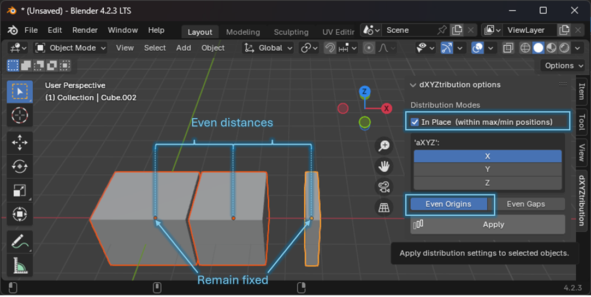
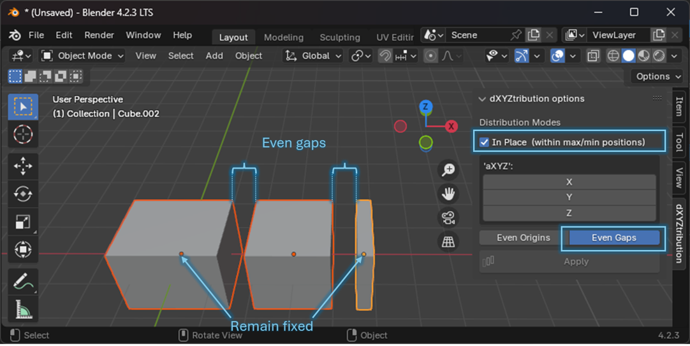
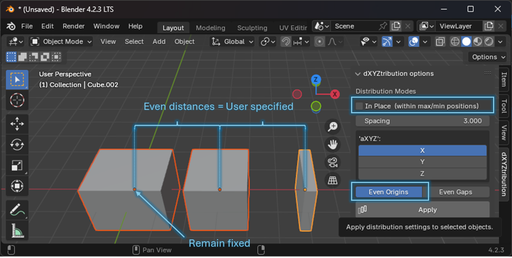
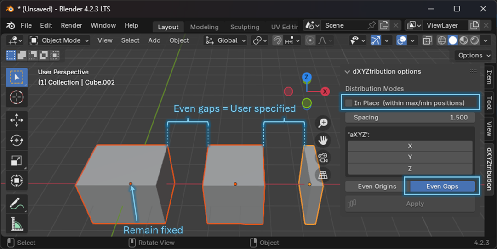
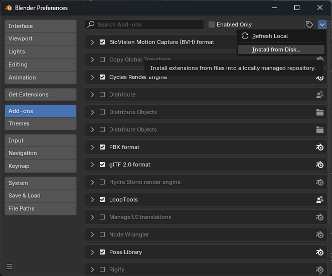
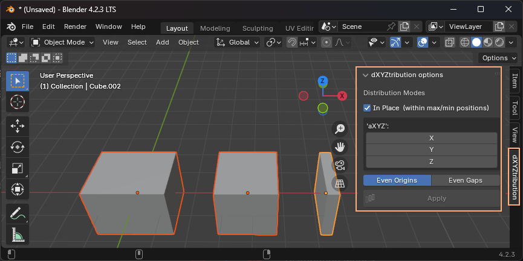

# dXYZtribution
Blender add-on for object distribution in 3 axis  
Ensures even distribution of selected objects along the chosen axis (X, Y, Z, or a combination of each).  
Different distribution options can be used, by executing each in a different iteration.  

## Distribution types
1. _**IN PLACE**_ - using existing objects' positinal interval (within max/min positions)  
   Objects placed in the outmost coordinates for the selected axis will remain in position and distance between them will be distributed evenly between remaining objects.  

   **Three objects, or more**, are required for this type of distribution (as the two outmost objects will remain in place, inner objects are required to distribute)

   When used together with:  
   - _**EVEN ORIGINS**_ - the available space between the origins of the two outmost object's origins is distributed evenly to space inner objects  
   PLEASE NOTE: Object sizes are not taken into account as the distribution will be focused on objects' origins. Gaps between objects can vary, if objects have different sizes. Also, object dimensions can overlap, depending on available space to distribute selected objects.  

   
     

   - _**EVEN GAPS**_ - Available space to distribute objects is the result of the net available space calculation, between the outmost objects (the distance is subtracted of the selected object's dimensions).  
   PLEASE NOTE: there must be a net available gap between objects to enable this distribution. Also, as object dimensions/sizes are the basis for this distribution mode, origins will, most likely, be distributed unevenly.  
   
   
     

   
2. _**SPACING**_ - Selected objects are distributed with an even spacing between them. The spacing is user defined.  
   The object with the lowest coordinate (per axis) will remain in it's position, and used to calculate new positions for the remaining objects.  

   When used together with:
   - _**EVEN ORIGINS**_ - distribution of selected objects' origins along the axis, spaced by the exact user defined value.  
   PLEASE NOTE: Object sizes are not taken into account as the distribution will be focused on objects' origins. Gaps between objects can vary, if objects have different sizes. Also, object dimensions can overlap, depending selected objects' sizes.  

   

   - _**EVEN GAPS**_ - Objects are spaced apart along the axis, by an exact amount defined by the user.   
   PLEASE NOTE: there must be a net available gap between objects to enable this distribution. Also, as object dimensions/sizes are the basis for this distribution mode, origins will, most likely, be distributed unevenly.  

   

Objects are sorted based on their initial coordinate - if the two or more objects share the same coordinate, their position in the collection will be used to sequence them.  

---
## Installation
Minimum requirements: Blender v2.80.0 and above

Installation procedure
1. download code (or just dZYXtribution.py file) into your local device
2. In Blender, open preferences dialog (Edit > Preferences)
3. Select "Add-ons" and go to the "Install from Disk" option, available on the top right corner of the preferences dialog (see image)  
   
4. After installation, you should see a new option in the Layout Toolbar (N key to activate the toolbar)  
   
----

## Potential improvements
- Negative gaps
- Selection of lowest/highest object to be used has the focal point for EVEN GAP distribution mode
- Path based distributions

